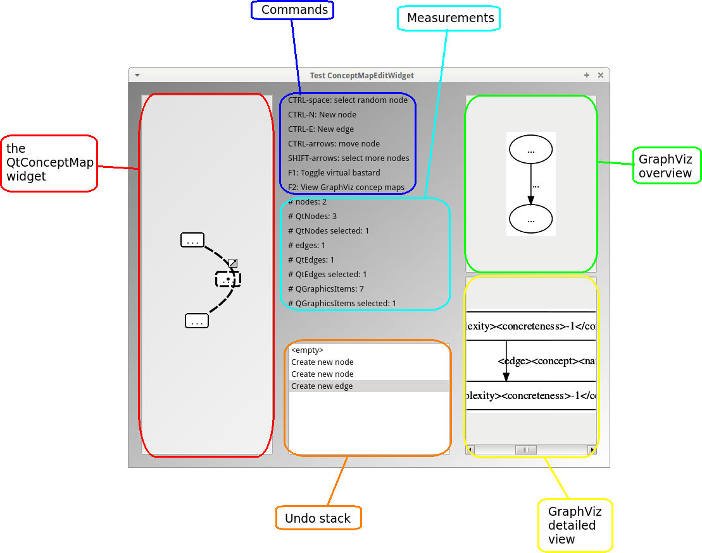
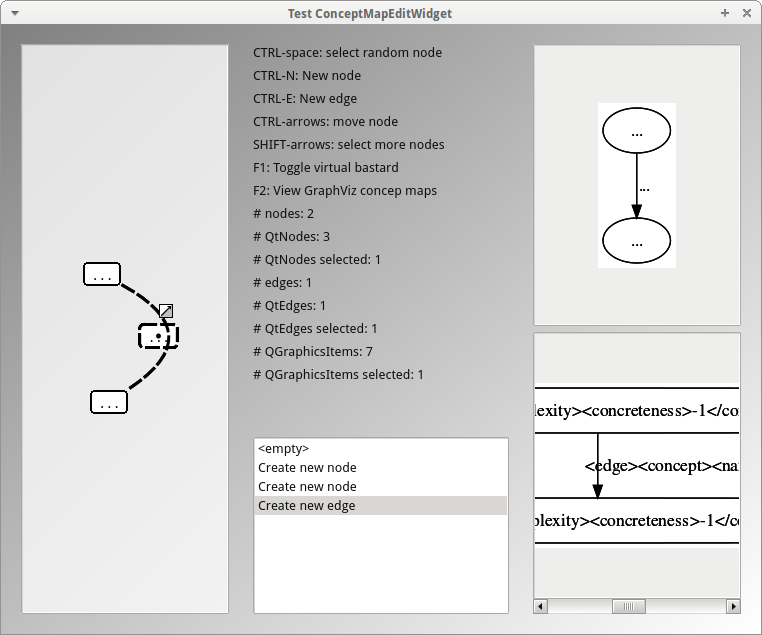

# TestConceptMap

TestConceptMap is a tool to test ConceptMap classes.



## Building

Building `TestConceptMap` should be easy on Debian or *ubuntu or other GNU/Linux distro's that use Debian as a package manager. If you have another
operating system or package manager, feel invited to add building instructions for those platforms.

To build `TestConceptMap` you will need to:

 * Install some packages
 * Download some other GitHubs
 * Build some other GitHubs
 * Build `TestConceptMap`

### Install packages

In the `TestConceptMap` folder, run the `install_packages.sh` script with root rights:

```
sudo ./install_packages.sh
```


### Download other GitHubs

In the `TestConceptMap` folder, run the `download_other_githubs.sh` script (without root access):

```
./download_other_githubs.sh
```

### Build other GitHubs

In the `TestConceptMap` folder, run the `build_other_githubs.sh` script (without root access):

```
./build_other_githubs.sh
```

### Build TestConceptMap

Within the `TestConceptMap` folder, 

 * Desktop: Open the Qt Creator project file `TestConceptMapDesktop.pro` in Qt Creator and build
 * Console: Open the Qt Creator project file `TestConceptMapConsole.pro` in Qt Creator and build. This project is more for debugging purposes of the program logic

If you do not use Qt Creator, you can build the project using `qmake` and `make` like this:

```
qmake TestConceptMapDesktop.pro
make
```

## Help

### Building fails!

I personally hate building problems, so I will be most happy to help you out. Please let me know, by, for example, adding an Issue.

### Other problems

Please let me know, by, for example, adding an Issue.

## Screenshots

